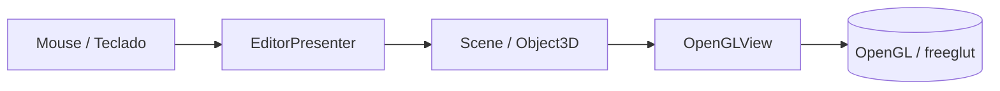

# Editor Gráfico 3D - Laboratorio 7

Proyecto en C++ con freeglut/OpenGL para un editor 3D interactivo, organizado con una estructura similar al Laboratorio 6 pero adaptado a escena, cámara y selección 3D.

## Propósito

La aplicación permite:

- Crear objetos 3D tipo cubo, esfera, toro y teapot.
- Seleccionar objetos con el mouse.
- Transformar el objeto activo con traslación, rotación y escala.
- Navegar la escena con cámara libre y cámara tipo trackball.
- Mostrar un gizmo de ejes y un panel de información del objeto seleccionado.

## Flujo del proyecto

La idea central sigue el patrón MVP usado en Lab 6:

- **Model**: contiene la escena, los objetos, sus propiedades y el estado de selección.
- **Presenter**: interpreta teclado y mouse, cambia el modo de trabajo, crea objetos y modifica cámara/transformaciones.
- **View**: dibuja la escena con OpenGL, el gizmo de ejes y la información en pantalla.



## Módulos cubiertos

- Sistema de administración de objetos con ID, tipo, posición, rotación, escala y color.
- Creación dinámica de objetos 3D con múltiples instancias.
- Selección de objeto con resaltado visual.
- Transformaciones básicas sobre el objeto seleccionado.
- Gizmo de ejes en el origen.
- Cámara con `gluLookAt()`.
- Proyección en perspectiva con `gluPerspective()`.
- Cámara tipo trackball controlada con mouse.

## Controles iniciales

- `1`: modo selección.
- `2`: crear cubo.
- `3`: crear esfera.
- `4`: crear toro.
- `5`: crear teapot.
- Click izquierdo: seleccionar o crear, según el modo activo.
- Click derecho y arrastre: orbitar la cámara tipo trackball.
- Rueda del mouse: zoom de la cámara.
- `W` / `S`: avanzar o retroceder la cámara.
- `A` / `D`: mover la cámara lateralmente.
- `Q` / `E`: mover la cámara en vertical.
- Flechas: mover el objeto seleccionado en X/Y.
- `[` / `]`: rotar el objeto seleccionado.
- `+` / `-`: escalar el objeto seleccionado.
- `X`: eliminar el objeto seleccionado.
- `Esc`: salir.

## Estructura de archivos

- `include/model`: geometría, escena y tipos 3D.
- `include/presenter`: lógica de interacción.
- `include/view`: renderizado con OpenGL.
- `src/model`: implementación de la escena.
- `src/presenter`: implementación del presentador.
- `src/view`: implementación de la vista.
- `src/main.cpp`: arranque de la aplicación.

## Construcción

En macOS con Homebrew:

```bash
cmake -S . -B build
cmake --build build
```

`clangd` queda apuntando a `build/compile_commands.json` mediante `.clangd`, así que el proyecto se reconoce al abrirlo en VS Code después de configurar CMake.

## Ejecución

```bash
./build/cg_lab7_editor3d
```

## Estado inicial

La base ya queda lista para:

- escena demo con objetos 3D,
- selección,
- traslación/rotación/escala,
- navegación de cámara,
- y documentación de uso y compilación.

El siguiente paso natural es afinar el picking, los paneles UI y las ayudas visuales para acercarlo más a la entrega final.
