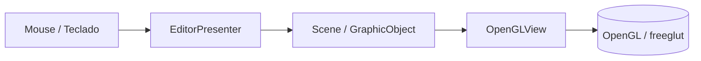

# Editor Gráfico 2D - Laboratorio 6

Proyecto en C++ con freeglut/OpenGL para un editor gráfico 2D modularizado con enfoque MVP.

## Idea general

La aplicación permite:

- Dibujar puntos.
- Crear líneas con dos clics.
- Construir polilíneas.
- Construir polígonos cerrados.
- Rellenar polígonos.
- Seleccionar objetos con el mouse.
- Transformar objetos seleccionados con matrices homogéneas hechas manualmente.

## Arquitectura

Se usa una estructura tipo MVP:

- **Model**: guarda la escena, los objetos, sus vértices, colores y estado de selección.
- **Presenter**: recibe eventos de mouse y teclado, cambia herramientas, crea objetos y aplica transformaciones.
- **View**: dibuja la escena usando OpenGL y rasteriza líneas/polígonos con algoritmos propios.



## Algoritmos implementados

- **Bresenham** para rasterizar líneas.
- **Scanline fill** para rellenar polígonos.
- **Point in polygon** para selección y validación.
- **Distancia punto-segmento** para detectar selección sobre líneas y polilíneas.
- **Matrices homogéneas 3x3** para traslación, rotación y escalamiento.

## Controles

- `1`: modo selección.
- `2`: crear punto.
- `3`: crear línea.
- `4`: crear polilínea.
- `5`: crear polígono.
- `Enter`: finalizar polilínea o polígono.
- `WASD` o flechas: trasladar el objeto seleccionado.
- `[` y `]`: rotar el objeto seleccionado.
- `+` y `-`: escalar el objeto seleccionado.
- `f`: activar o desactivar relleno en polígonos.
- `C`: seleccionar el siguiente objeto.
- `Esc`: cancelar la figura en edición y limpiar la selección.

## Estructura de archivos

- `include/model`: geometría, escena y algoritmos.
- `include/presenter`: lógica de interacción.
- `include/view`: renderizado.
- `src/model`: implementación del modelo y algoritmos.
- `src/presenter`: implementación del presentador.
- `src/view`: implementación de la vista.
- `src/main.cpp`: arranque de la aplicación.

## Compilación

En macOS con Homebrew:

```bash
cmake -S . -B build
cmake --build build
```

## Ejecución

```bash
./build/cg_lab6_editor2d
```

## Estado actual

Ya existe una base funcional con:

- Escena de demostración con más de 10 objetos.
- Selección por clic.
- Transformaciones sobre el objeto seleccionado.
- Relleno de polígonos.
- Dibujo manual de líneas con Bresenham.

El siguiente paso natural es refinar la interacción de dibujo para que polilíneas y polígonos queden más cómodos de usar durante la demostración.
